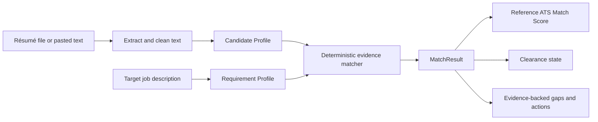

# Signrl ATS Intelligence: Day 1 Matching Engine and AI-Agent Protocol

**Purpose:** This document converts the approved Signrl ATS private-MVP direction into a focused Day 1 engineering structure and a safe way to use an additional AI coding agent without conflicting changes.

> **The three-day target is achievable only as a private validation MVP.** It is not a promise to recreate every feature of an established ATS platform. The first release must complete one trustworthy user journey: **résumé in → job description in → explainable alignment result → truthful next actions.**

---

## 1. Direct recommendation on using another AI coding agent

Yes, you can use another AI coding agent alongside Manus. The safe method is **not** to give two agents simultaneous control of the same VS Code files. Instead, use GitHub branches and pull requests as the hand-off mechanism.

### Recommended setup: Manus + GitHub Copilot cloud agent

I recommend **GitHub Copilot cloud agent** as the second coding agent for this project because your working code is already in a private GitHub repository. Copilot can research one repository, create a plan, make changes on its own branch, run checks, and create a pull request for review.[1]

| Role | Recommended owner | Responsibility |
|---|---|---|
| **Product architect and reviewer** | Manus | Protect the Signrl principles, define the engine contract, review changes, test outcomes, and keep the MVP focused. |
| **Task-based coding worker** | GitHub Copilot cloud agent | Implement a small, self-contained issue on a separate GitHub branch and open a pull request. |
| **Final decision-maker** | You | Approve the scope, inspect the plain-English summary, and approve any merge. |

This arrangement is safer than asking a local agent to edit the same files while someone else is editing in VS Code. The resulting work is visible in commits and pull requests, and you can compare or undo it.

### Why GitHub Copilot is the best first choice for this project

Copilot cloud agent works directly on GitHub, creates a separate branch, and produces a reviewable pull request instead of silently changing your live local files.[1] This fits a non-technical owner because the work is kept in one visible place.

**Important limitation:** GitHub documents that Copilot cloud agent requires a paid Copilot plan and uses GitHub Actions minutes and AI credits.[1] Check your GitHub account before choosing it; do not purchase anything solely for this project until you see that the beta scope and existing code are viable.

### Good alternatives—but do not use them at the same time

| Agent | Best use | Main drawback for this three-day build |
|---|---|---|
| **OpenAI Codex extension in VS Code** | Focused local edits and code explanation beside the open files. | It edits in the local working copy, so it needs careful checkpoints and should not run in parallel with another local editor agent.[2] |
| **Cursor** | A powerful code-focused editor with autonomous agents and parallel task capabilities. | It requires moving from VS Code to a separate editor workflow; that adds change-management risk during a short sprint.[3] |
| **GitHub Copilot cloud agent** | Separate-branch implementation with a pull request to review. | Requires the relevant Copilot access and should be assigned only small, precise tasks. |

> **Do not run Cursor, Codex, Copilot, and Manus as simultaneous editors of the same branch.** Choose one coding worker at a time. For this sprint, use Copilot cloud agent *or* use Manus-led implementation after the Shortlitz code is synced—not both on the same task simultaneously.

### The safe three-day agent protocol

1. Push the current Shortlitz commit to GitHub using **Sync Changes** in VS Code.
2. Manus reviews the actual code and creates a short, written task list.
3. Assign **one small issue** to Copilot cloud agent, such as “return requirement-level match results for the test fixtures.”
4. Copilot works on its own branch and opens a pull request.
5. Manus reviews the pull request against the Signrl specifications and tests.
6. You approve the merge only after the review says the scope, score semantics, and file handling are correct.

GitHub’s own guidance states that the cloud agent works on a repository branch and can create a pull request; its sessions have a maximum execution time, so tasks should remain small and focused.[1]

---

## 2. Day 1 objective

Day 1 does **not** build a polished dashboard. It proves that the core engine can create structured, explainable output from a résumé and a job description.

> **Day 1 definition of success:** Given a known test résumé and a known target job description, Signrl produces a repeatable Candidate Profile, Requirement Profile, MatchResult, ATS Match Score, clearance state, and requirement-level evidence list.

### Day 1 output contract



No generative AI and no embedding-based score contribution are required on Day 1. The scoring result must be deterministic, explainable, and repeatable.

---

## 3. The Day 1 architecture

### 3.1 Keep five clear modules

| Module | Job | Must return |
|---|---|---|
| **1. Input and extraction** | Accept PDF, DOCX, or pasted résumé text; clean obvious formatting noise. | `ExtractedResumeText`, parse warnings, parseability signal. |
| **2. Candidate profile builder** | Turn résumé text into structured skills, roles, experience bullets, education, and certifications. | `CandidateProfile`. |
| **3. Job requirement builder** | Turn one pasted job description into required/preferred skills, responsibilities, title, seniority, and explicit minimum conditions. | `RequirementProfile`. |
| **4. Deterministic matcher** | Compare each requirement with structured résumé evidence in a defined order. | Requirement-level match records. |
| **5. Result assembler** | Calculate the reference alignment score, clearance state, gaps, and user-safe explanations. | `MatchResult`. |

The user interface must display the `MatchResult`; it must **not** calculate the score or invent match explanations.

### 3.2 Minimum domain contracts

The specific TypeScript names can adapt to the existing Shortlitz code, but the information contract should be stable.

```ts
type EvidenceState = "matched" | "partial" | "not_evidenced" | "unverifiable";
type MatchMethod = "exact" | "normalized" | "taxonomy" | "context" | "none";
type Importance = "required" | "preferred";
type ClearanceStatus = "cleared" | "review" | "hold";

type CandidateEvidence = {
  text: string;
  source: "experience" | "achievement" | "project" | "skills" | "education" | "certification";
  canonicalTerms: string[];
};

type CandidateProfile = {
  skills: CandidateEvidence[];
  experiences: CandidateEvidence[];
  projects: CandidateEvidence[];
  education: CandidateEvidence[];
  certifications: CandidateEvidence[];
  titles: CandidateEvidence[];
  parseability: "good" | "review" | "poor";
};

type Requirement = {
  id: string;
  text: string;
  canonicalTerms: string[];
  importance: Importance;
  sourcePhrase: string;
  category: "skill" | "responsibility" | "experience" | "education" | "certification" | "title";
};

type RequirementMatch = {
  requirementId: string;
  state: EvidenceState;
  method: MatchMethod;
  evidence: CandidateEvidence[];
  evidenceStrength: "strong" | "supported" | "limited" | "none";
  contribution: number;
  explanation: string;
  action: string | null;
};

type MatchResult = {
  scoreVersion: "beta-0.1";
  overallScore: number;
  clearanceStatus: ClearanceStatus;
  parseability: CandidateProfile["parseability"];
  matches: RequirementMatch[];
  strengths: string[];
  gaps: RequirementMatch[];
  userNotice: string;
};
```

The terms `not_evidenced` and `unverifiable` are important. They prevent the system from treating lack of résumé proof as lack of human capability.

---

## 4. Day 1 deterministic matching order

The matching sequence should follow the approved Signrl hierarchy. It should stop at the first strongest defensible result.

| Order | Test | Example | Initial state |
|---:|---|---|---|
| 1 | **Exact evidence** | Job requires `Kubernetes`; résumé says `Kubernetes`. | `matched` |
| 2 | **Normalised evidence** | `Amazon Web Services` and `AWS` map to the same canonical term. | `matched` |
| 3 | **Taxonomy evidence** | Job requires `React`; résumé supports `React.js` if the taxonomy confirms equivalence. | `matched` or `partial` |
| 4 | **Context evidence** | Résumé achievement names a relevant responsibility with a supporting outcome. | `matched` or `partial` |
| 5 | **No sufficient evidence** | No defensible evidence appears in the submitted résumé. | `not_evidenced` |

**Day 1 deliberately excludes:** embedding similarity, hidden semantic scores, and generative-AI score calculation. Those are later enhancements only after they can produce a logged and defensible résumé phrase/job phrase pair.

---

## 5. A transparent beta score—not a false ATS prediction

The initial formula must be labelled **`beta-0.1`** and stored with the result. It is a reference alignment measure pending Golden Set calibration.

### Recommended beta calculation

```text
per requirement contribution
  = importance weight × evidence weight

ATS Match Score
  = 100 × sum(all requirement contributions) / sum(all possible importance weights)
```

| Condition | Importance weight | Evidence weight | Rationale |
|---|---:|---:|---|
| Required requirement | 3 | — | Required conditions matter more but do not convert the score into a probability. |
| Preferred requirement | 1 | — | Helpful evidence with lower impact. |
| Exact/normalised evidence in an experience, achievement, project, education, or certification context | — | 1.00 | Strong direct support. |
| Exact/normalised evidence only in a skills list | — | 0.55 | Visible term, but lower support without corroboration. |
| Taxonomy/context evidence with supporting text | — | 0.75 | Plausible, traceable support. |
| Partial evidence | — | 0.35 | Some relevant evidence but not sufficient full support. |
| Not evidenced / unverifiable | — | 0.00 | No contribution; no assumption about the candidate. |

These values are a **starting contract for testing**, not calibrated production weights. The engine must not change them to make an individual résumé look better.

### Day 1 clearance rule

| Status | Rule | User-safe label |
|---|---|---|
| `cleared` | All explicit required requirements are matched with sufficient evidence, and parseability is good. | “No explicit required-condition gap was detected in this résumé.” |
| `review` | One or more explicit required requirements is partial or not evidenced. | “Review these required conditions before applying.” |
| `hold` | Résumé parseability is poor, job requirements are not reliably extractable, or analysis is incomplete. | “This result needs review before relying on it.” |

The word **cleared** must never mean “will pass the employer ATS.” The score and gate need a visible line such as:

> “This is a reference alignment result based on the evidence in your submitted résumé. It is not a prediction of an employer’s ATS or hiring decision.”

---

## 6. Result screen: the minimum useful experience

The first results page should not be a dense dashboard. It should guide the user from diagnosis to action.

1. **Top result:** ATS Match Score, `beta-0.1`, the reference-score notice, and Clearance Status.
2. **Three strongest matches:** show each target requirement and the exact résumé evidence found.
3. **Priority gaps:** show required conditions first, then high-value preferred conditions.
4. **One concrete action per gap:** for example, “If accurate, add a stakeholder-management outcome from your regional delivery work.”
5. **Parseability warning:** show this only when the document is poorly structured or the extraction is incomplete.
6. **Optional beta feedback:** “Was this analysis useful?” plus an optional later outcome check-in.

### Required wording patterns

| Use | Avoid |
|---|---|
| “Not evidenced in your résumé.” | “You do not have this skill.” |
| “Your résumé shows strong alignment with this requirement.” | “You will pass the ATS.” |
| “Add supporting evidence if this reflects your experience.” | “Add this keyword to increase your score.” |
| “Reference alignment score.” | “Your ATS pass rate.” |

---

## 7. Day 1 test pack

Create a small, private test pack before connecting the results to a user interface.

| Fixture | What it proves |
|---|---|
| Strong direct-match résumé | Exact and normalised matches receive expected credit. |
| Keyword-stuffed résumé | Unsupported repetition does not raise the score materially. |
| Career-changer résumé | Supported transferable evidence can be marked `partial` without inventing capability. |
| Poorly formatted résumé | Parseability produces `review` or `hold`, not a false precise score. |
| Missing required credential | Clearance becomes `review` even if the overall score is high. |
| Identical input rerun | Score and requirement results remain the same. |

At least one unit test should assert each approved principle: no candidate-absence claim, required conditions cannot be hidden by a high score, and skills-list-only evidence is capped.

---

## 8. Privacy and data handling for the first three days

The private beta should begin with the smallest possible exposure of résumé data.

| Area | Day 1–3 rule |
|---|---|
| Access | Invite-only authenticated testers. |
| File input | Validate file type and size; always provide a paste-text fallback. |
| Raw file storage | Keep private; do not expose file URLs in the browser. |
| AI use | Do not send full raw résumés to a third-party model for scoring. |
| Retention | State that testers can request deletion; agree the exact retention window before public launch. |
| Outcomes | Opt-in only; keep separate from scoring and use no public claims from early small samples. |

---

## 9. Three-day task division

| Day | Manus-led priority | Optional Copilot task—one branch only | Acceptance check |
|---|---|---|---|
| **Day 1** | Inspect synced Shortlitz code; map current parsers, taxonomy, and score functions to the stable contracts above. | Add/complete deterministic `RequirementMatch` output for known test fixtures. | One known résumé/JD pair produces stable structured output. |
| **Day 2** | Build or refine the result assembler, score explanation, and clearance rule. | Add unit tests for missing required condition and keyword stuffing. | Score, gate, evidence, and gaps are mutually consistent. |
| **Day 3** | Add private beta workflow, error states, safe copy, and human review. | Improve result-card presentation or test coverage only after core engine is stable. | An invited tester can complete the end-to-end flow without a misleading claim. |

---

## 10. The next action

1. In VS Code, complete the **Sync Changes 1↑** upload so the current ATS modules are available in GitHub.
2. Send confirmation or a screenshot once Sync finishes.
3. Manus will inspect the actual `shortlitz` codebase and map its existing parsers, normalisers, taxonomy, and score functions to this Day 1 contract.
4. Only then choose whether to assign a narrowly defined GitHub Copilot task.

## References

[1]: https://docs.github.com/copilot/concepts/agents/cloud-agent/about-cloud-agent "GitHub Docs: About GitHub Copilot cloud agent"
[2]: https://learn.chatgpt.com/docs/codex/ide "OpenAI: Codex IDE extension"
[3]: https://cursor.com/ "Cursor: AI coding agent"

### Internal product sources

- `02_PRODUCT_PRINCIPLES.docx`
- `03_ARCHITECTURE.docx`
- `03_ENGINEERING_PHILOSOPHY.docx`
- `04_ROADMAP.docx`
- `05_ATS_MATCHING_ENGINE.docx`
- `07_DECISION_FRAMEWORK.docx`
- `08_AI_PRINCIPLES.docx`
- `09_DATA_MODEL.docx`
- `10_DEFINITION_OF_DONE.docx`
- `11_ALIGNMENT_NOTES.md`
- `12_VALIDATION_GTM_ADDENDUM.docx`
